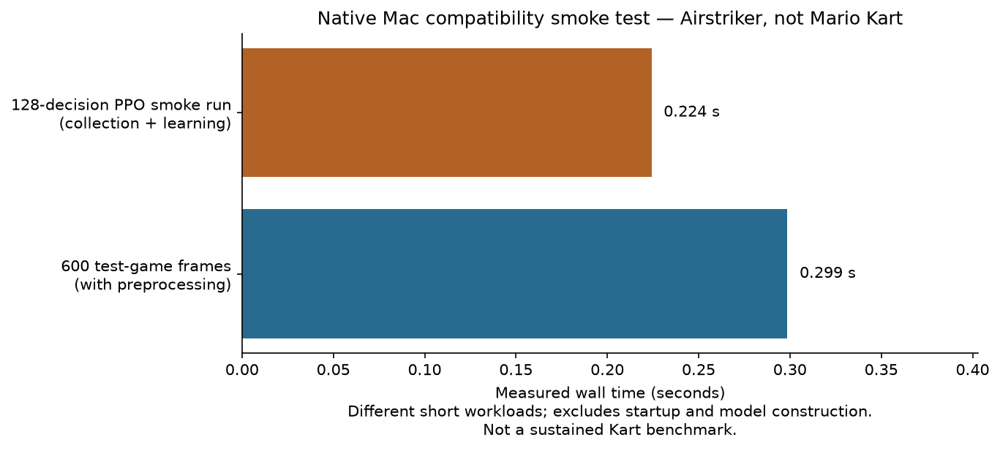

# Setup session — September 16, 2026

**Status: waiting for Super Mario Kart ROM. No Kart training has occurred.**

The classroom scaffolding and native Mac dependency check are prepared. The original Mario project was preserved. [Raw compatibility measurements](compatibility.json) are archived separately from any future gameplay session.

[Publication verification](publication.json) records matching remote file hashes and anonymous HTTP 200 responses for the public index, report, and chart at the stated source revision.

## What was measured

| Check | Observed result |
|---|---|
| Host | Apple M4 / 16 GB / macOS 26.6.2 / arm64 |
| Python | 3.13.15 |
| Stable-Retro / Gymnasium / SB3 | 1.0.1 / 1.3.0 / 2.9.0 |
| Test game | Stable-Retro's bundled Airstriker-Genesis-v0, not Mario Kart |
| Gymnasium interface check | Passed |
| 600 raw test-game steps plus wrapper preprocessing | 0.299 seconds (about 2,009 frames/s in this short check) |
| 128-decision test PPO run | 0.224 seconds, including rollout and learning |
| Model parameters | Changed and finite after the smoke update |
| RSS after the check | 348.5 MiB; not a peak-memory measurement |
| MPS available to this process | No; CPU was used |
| Local automated tests | 11 passed: reward exploits, wrapper/frame accounting, PPO save/load, traces/clips, and incomplete evaluation |
| Dependency consistency | `pip check` passed |

These short timings exclude cold import/model-construction costs and are not sustained throughput benchmarks. They cannot be used to choose a Mario Kart training budget. A test on a Genesis game does not verify the SNES core or the Kart integration.

## What changed and what remains unknown

The change in this stage is infrastructure: an isolated environment, candidate integration metadata, conservative reward-accounting tests, bounded session scripts, evaluation traces/clips, and English teaching materials. No improvement in Mario's driving has been observed, and there is no Mario mistake to explain yet.

The default display renderer failed in the restricted execution context; RGB-array mode worked. Candidate checkpoint/lap addresses need direct validation. The actual track geometry, controls, reset state, lap count, finish detection, frame rate, and PPO session behavior remain pending.

## Stage gallery

| Stage | Model | Evaluation | Clips | Interpretation |
|---|---|---|---|---|
| Preparation | No Kart model | Not run: ROM missing | Not available | Software and experiment design only |
| Untrained baseline | Pending game validation | Pending | Pending | No numerical or visual claim |
| Hold accelerate | No learned model required | Pending | Pending | No numerical or visual claim |
| 10–15-minute pilot | Pending | Pending | Pending | User requested this after setup works |

There are no downloadable Kart checkpoints yet, so no placeholder model Release was created. Future sessions will keep this setup report unchanged and add their own reports to the [same classroom index](../../docs/classroom/README.md).
