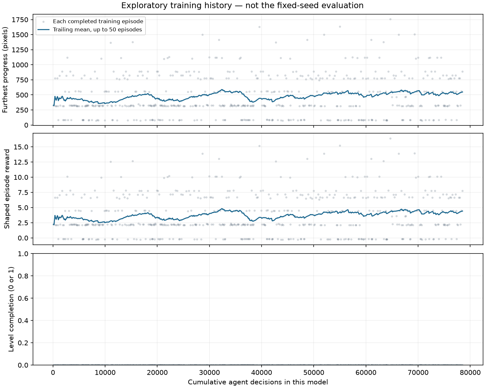

# Visual analysis — SMB3 World 1-1 pilot

This analysis distinguishes observations from hypotheses. Training reward and horizontal progress do not substitute for level completion. The scripted successful run in the validation session is not a learned policy and is excluded from the comparisons below.

## Initial untrained policy

**What changed:** nothing has been learned. This is a fresh PPO CNN with seed 123, evaluated with five stochastic action seeds on the same saved start.

**Measured:** 0/5 clears; all five episodes ended in death. Progress beyond the start was 326, 326, 887, 776 and 553 pixels (mean 573.6). See [all measurements](00-untrained/evaluation.json).

**Observed behavior:** in seed 101's [ending clip](00-untrained/trial-101-ending.gif), Mario moves past the opening enemy/blocks, approaches the first pipe with a plant, and then appears in the death animation before the fade-out. The [full trace](00-untrained/trial-101.jsonl) records the failure, rather than the false success from the original package. [Review contact sheet](review/00-untrained-ending.png).

**What remains uncertain:** this one visible mistake does not establish that the untrained network detects or ignores plants. Randomly sampled actions can sometimes make substantial progress without a useful learned strategy. The spread across trials is evidence of sampling variation on the same level.

## Hold-run-right baseline

**What changed:** a fixed controller holds right+B and never presses jump. There is no model or learning update.

**Measured:** 0/5 clears, all deaths, 88 pixels of progress in every trial. These are duplicate deterministic replays, not five independently varied levels. [Measurements](hold-run-right/evaluation.json).

**Observed behavior:** the [seed 101 clip](hold-run-right/trial-101-ending.gif) shows Mario moving toward the first walking enemy, followed by the death animation. The upward motion after contact is not a successful commanded jump: the [trace](hold-run-right/trial-101.jsonl) contains only right+B. [Review contact sheet](review/hold-run-right-ending.png).

**Lesson:** holding forward is insufficient here. This baseline anchors the interpretation of progress made by randomly initialized and trained policies.

## Trained stage (01-stage)

**What changed:** 567.54 seconds (9.46 minutes) of additional local training, 313,478 emulator action frames, 78,581 agent decisions, 153 PPO train calls and 4,726 optimizer steps. The policy learned only from screenshots and the documented shaped reward. No scripted validation actions were supplied as demonstrations.

**Measured:** 0/5 clears, all deaths. Mean progress increased from 573.6 to 754.4 pixels (+180.8, about 31.5%). This is progress improvement on this small fixed-seed sample, not proof of reliable completion. [Stage measurements](01-stage/evaluation.json).

| Seed | Untrained progress | Trained progress | Change (pixels) |
|---|---:|---:|---:|
| 101 | 326 | 763 | +437 |
| 202 | 326 | 319 | −7 |
| 303 | 887 | 760 | −127 |
| 404 | 776 | 1373 | +597 |
| 505 | 553 | 557 | +4 |

Two of five paired trials regressed. All are retained; the improved mean must not hide them.

**Observed improvement:** seed 101 gets beyond the first pipe that ended its untrained trial, then reaches a later open area with walking enemies. It still dies there. Compare the [trained ending clip](01-stage/trial-101-ending.gif) with the initial clip above. The [final-policy contact sheet](review/final-101-ending.png) shows the same replay; the [trace](01-stage/trial-101.jsonl) records x=339 at decision 100 and x=633 at decision 150.

**Remaining failures:** seed 202 again dies by the first plant pipe ([clip](01-stage/trial-202-ending.gif), [contact sheet](review/final-202-ending.png)); seed 404 reaches raised platforms with flying enemies and then dies ([clip](01-stage/trial-404-ending.gif), [contact sheet](review/final-404-ending.png)). These locations are visible in the clips. The neural network's reason for a particular button choice is not established by these observations.

Across the five recorded trials, run-and-jump was sampled 318/999 decisions (31.8%) after training versus 207/1050 (19.7%) before training. This describes these traces, whose routes and durations differ; it is not a causal explanation or a universal action probability.

## Final checkpoint

No additional learning occurred between 01-stage and final. Their saved `policy.pth` SHA-256 is identical (`921b09befd441929650f677f816fe238c7132d3015f1105e29d71f907a57ff63`), and the repeated five-seed results match. Both checkpoints are retained for stage provenance; they are not independent improvements. [Final evaluation](final/evaluation.json).

The ten additional action seeds also produced 0/10 clears, all deaths, with mean progress 667.9 pixels and range 81–1628. Three trials failed within 86 pixels of the start. In [seed 6707's clip](final-additional-trials/trial-6707-ending.gif), Mario still fails near the first walking enemy ([contact sheet](review/final-additional-trials-6707-ending.png)). The policy remains unreliable even in the opening section. These seeds do not test another level.

## Training history and limitations

The training trace contains 555 completed episodes, no clears, and a maximum observed progress of 1756 pixels. A trailing 60-decision partial episode is excluded from this episode chart. The final rollout includes collected decisions that did not receive another PPO update at the time limit. The smoothed training curve is exploratory behavior under a changing policy, not the frozen-policy evaluation.

**Observed instrumentation failure:** the original memory monitor failed before recording a peak. Its zero field means unavailable data. The independent monitor covered only the last 371.8 seconds, observing up to 495.3 MiB combined parent/child RSS; it cannot establish the full-run peak. [Measurement](memory-partial.json) · [Failure log](logs/memory-monitor-failure.txt).

**Hypotheses to test later:** more experience may improve jump timing, and the right-only action set may limit recovery. Neither explanation is established by this one pilot. A useful next experiment is additional training with unchanged gameplay settings and the same checkpoint protocol, using a budget chosen by the user.

**Budget decision:** no additional training was launched after this pilot. The setup works and progress increased on average, but level completion has not been achieved by the learned policy.

[Download the verified model checkpoints](MODELS.md).

[Publication and anonymous-link verification](publication.json).
