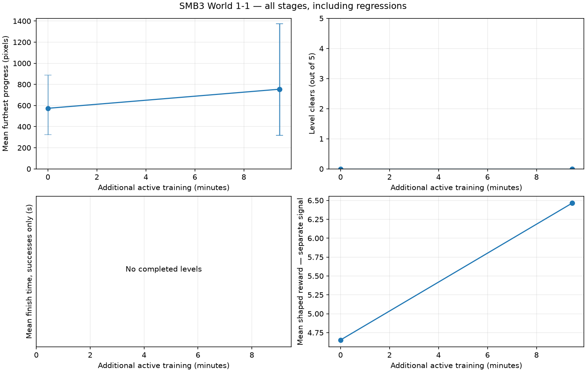
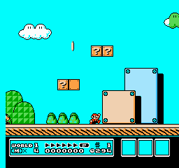
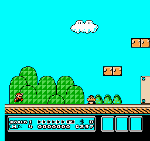
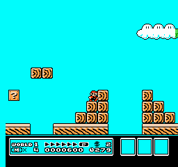

# SMB3 World 1-1 — 2026-09-16-smb3-pilot

Session status: **completed**. This is a local CPU experiment.

[Manifest](manifest.json) · [Configuration](config.json) · [Dependencies](requirements.txt)

## Time and work measured

| Measurement | Value |
|---|---:|
| Session wall time before chart generation | 622.09 s |
| Active training | 567.54 s |
| Rollout collection (includes inference and traces) | 345.14 s |
| Raw emulator stepping inside collection | 223.76 s |
| Learning updates | 222.26 s |
| Evaluation subprocesses (includes recording/startup) | 52.68 s |
| Checkpoint saving | 0.08 s |
| Training game frames | 313,478 |
| Agent decisions | 78,581 |
| PPO train calls / optimizer steps | 153 / 4726 |
| Sampled peak RSS | Full-run peak unavailable: original monitor failed; see partial-coverage measurement below |

Nested timing fields overlap: raw stepping is part of collection, and collection/learning are part of active training. RSS is sampled every 100 ms; shared pages may be counted twice. Reset/setup frames are excluded from action-frame counters.

**Memory limitation:** the built-in sampler failed on macOS child-process enumeration. The independent monitor observed a peak of 495.3 MiB across 371.8 seconds of late training/evaluation/reporting, starting at 2026-09-16T18:40:06.639721+00:00. Earlier samples are missing. [Raw partial measurement](memory-partial.json) · [Failure log](logs/memory-monitor-failure.txt).

Raw simulation: 1401 frames/s; end-to-end training: 552 frames/s; learning: 21.3 optimizer steps/s.

## Outcomes across stages

Error bars show the range across the five trials, not confidence intervals. Progress is furthest horizontal displacement from the start, in pixels, not a percentage of the level. Completion is measured independently. Finishing time uses action frames / 60, only for completed levels. Training reward is plotted separately and is not a success rate.

## 00-untrained

0.00 additional active minutes. Model SHA-256: `e9aeb87e3dcc21c80362ebfad73600a11a8b4ce83cca7621b6d545e90f655d0b`.

Evaluation **complete**: 5/5 finished trials. [Full measurements](00-untrained/evaluation.json).

**Observed measurements:** 0/5 clears; 5 deaths; mean progress 573.6 pixels (range 326–887); mean shaped reward 4.652.

| Trial | Progress (pixels) | Outcome | Evidence |
|---|---:|---|---|
| 101 | 326 | death | [Trace](00-untrained/trial-101.jsonl) · [beginning](00-untrained/trial-101-beginning.gif) · [ending](00-untrained/trial-101-ending.gif) |
| 202 | 326 | death | [Trace](00-untrained/trial-202.jsonl) · [beginning](00-untrained/trial-202-beginning.gif) · [ending](00-untrained/trial-202-ending.gif) |
| 303 | 887 | death | [Trace](00-untrained/trial-303.jsonl) · [beginning](00-untrained/trial-303-beginning.gif) · [ending](00-untrained/trial-303-ending.gif) |
| 404 | 776 | death | [Trace](00-untrained/trial-404.jsonl) · [beginning](00-untrained/trial-404-beginning.gif) · [ending](00-untrained/trial-404-ending.gif) |
| 505 | 553 | death | [Trace](00-untrained/trial-505.jsonl) · [beginning](00-untrained/trial-505-beginning.gif) · [ending](00-untrained/trial-505-ending.gif) |

Comparable example: seed 101 (fixed first seed, not selected for best performance).

## 01-stage

9.46 additional active minutes. Model SHA-256: `5faa99a153ae7a3d1e26bc02a50e84f1e6e66f2a8074847a282f1cabc0a27722`.

Evaluation **complete**: 5/5 finished trials. [Full measurements](01-stage/evaluation.json).

**Observed measurements:** 0/5 clears; 5 deaths; mean progress 754.4 pixels (range 319–1373); mean shaped reward 6.464.

Mean progress changed by +180.8 pixels; completion count changed by +0. Improvement is not assumed, and five action samples are a small evaluation.

| Trial | Progress (pixels) | Outcome | Evidence |
|---|---:|---|---|
| 101 | 763 | death | [Trace](01-stage/trial-101.jsonl) · [beginning](01-stage/trial-101-beginning.gif) · [ending](01-stage/trial-101-ending.gif) |
| 202 | 319 | death | [Trace](01-stage/trial-202.jsonl) · [beginning](01-stage/trial-202-beginning.gif) · [ending](01-stage/trial-202-ending.gif) |
| 303 | 760 | death | [Trace](01-stage/trial-303.jsonl) · [beginning](01-stage/trial-303-beginning.gif) · [ending](01-stage/trial-303-ending.gif) |
| 404 | 1373 | death | [Trace](01-stage/trial-404.jsonl) · [beginning](01-stage/trial-404-beginning.gif) · [ending](01-stage/trial-404-ending.gif) |
| 505 | 557 | death | [Trace](01-stage/trial-505.jsonl) · [beginning](01-stage/trial-505-beginning.gif) · [ending](01-stage/trial-505-ending.gif) |

Comparable example: seed 101 (fixed first seed, not selected for best performance).

## final

9.46 additional active minutes. Model SHA-256: `2e8a5244bad04fcc92f378637b62bb9a7484186b174de05ee82bd4ccfe87f878`.

Evaluation **complete**: 5/5 finished trials. [Full measurements](final/evaluation.json).

**Observed measurements:** 0/5 clears; 5 deaths; mean progress 754.4 pixels (range 319–1373); mean shaped reward 6.464.

Mean progress changed by +0.0 pixels; completion count changed by +0. Improvement is not assumed, and five action samples are a small evaluation.

| Trial | Progress (pixels) | Outcome | Evidence |
|---|---:|---|---|
| 101 | 763 | death | [Trace](final/trial-101.jsonl) · [beginning](final/trial-101-beginning.gif) · [ending](final/trial-101-ending.gif) |
| 202 | 319 | death | [Trace](final/trial-202.jsonl) · [beginning](final/trial-202-beginning.gif) · [ending](final/trial-202-ending.gif) |
| 303 | 760 | death | [Trace](final/trial-303.jsonl) · [beginning](final/trial-303-beginning.gif) · [ending](final/trial-303-ending.gif) |
| 404 | 1373 | death | [Trace](final/trial-404.jsonl) · [beginning](final/trial-404-beginning.gif) · [ending](final/trial-404-ending.gif) |
| 505 | 557 | death | [Trace](final/trial-505.jsonl) · [beginning](final/trial-505-beginning.gif) · [ending](final/trial-505-ending.gif) |

Comparable example: seed 101 (fixed first seed, not selected for best performance).

## Run right baseline

Status: complete. [Measurements](hold-run-right/evaluation.json).

0/5 clears; mean progress 88.0 pixels. Additional seeds are action samples on the same level, not unseen levels.

| Trial | Progress (pixels) | Outcome | Evidence |
|---|---:|---|---|
| 101 | 88 | death | [Trace](hold-run-right/trial-101.jsonl) · [beginning](hold-run-right/trial-101-beginning.gif) · [ending](hold-run-right/trial-101-ending.gif) |
| 202 | 88 | death | [Trace](hold-run-right/trial-202.jsonl) · [beginning](hold-run-right/trial-202-beginning.gif) · [ending](hold-run-right/trial-202-ending.gif) |
| 303 | 88 | death | [Trace](hold-run-right/trial-303.jsonl) · [beginning](hold-run-right/trial-303-beginning.gif) · [ending](hold-run-right/trial-303-ending.gif) |
| 404 | 88 | death | [Trace](hold-run-right/trial-404.jsonl) · [beginning](hold-run-right/trial-404-beginning.gif) · [ending](hold-run-right/trial-404-ending.gif) |
| 505 | 88 | death | [Trace](hold-run-right/trial-505.jsonl) · [beginning](hold-run-right/trial-505-beginning.gif) · [ending](hold-run-right/trial-505-ending.gif) |

Comparable example: seed 101 (fixed first seed, not selected for best performance).

## Final additional trials

Status: complete. [Measurements](final-additional-trials/evaluation.json).

0/10 clears; mean progress 667.9 pixels. Additional seeds are action samples on the same level, not unseen levels.

| Trial | Progress (pixels) | Outcome | Evidence |
|---|---:|---|---|
| 6101 | 1628 | death | [Trace](final-additional-trials/trial-6101.jsonl) · [beginning](final-additional-trials/trial-6101-beginning.gif) · [ending](final-additional-trials/trial-6101-ending.gif) |
| 6202 | 1116 | death | [Trace](final-additional-trials/trial-6202.jsonl) · [beginning](final-additional-trials/trial-6202-beginning.gif) · [ending](final-additional-trials/trial-6202-ending.gif) |
| 6303 | 775 | death | [Trace](final-additional-trials/trial-6303.jsonl) · [beginning](final-additional-trials/trial-6303-beginning.gif) · [ending](final-additional-trials/trial-6303-ending.gif) |
| 6404 | 752 | death | [Trace](final-additional-trials/trial-6404.jsonl) · [beginning](final-additional-trials/trial-6404-beginning.gif) · [ending](final-additional-trials/trial-6404-ending.gif) |
| 6505 | 824 | death | [Trace](final-additional-trials/trial-6505.jsonl) · [beginning](final-additional-trials/trial-6505-beginning.gif) · [ending](final-additional-trials/trial-6505-ending.gif) |
| 6606 | 555 | death | [Trace](final-additional-trials/trial-6606.jsonl) · [beginning](final-additional-trials/trial-6606-beginning.gif) · [ending](final-additional-trials/trial-6606-ending.gif) |
| 6707 | 86 | death | [Trace](final-additional-trials/trial-6707.jsonl) · [beginning](final-additional-trials/trial-6707-beginning.gif) · [ending](final-additional-trials/trial-6707-ending.gif) |
| 6808 | 86 | death | [Trace](final-additional-trials/trial-6808.jsonl) · [beginning](final-additional-trials/trial-6808-beginning.gif) · [ending](final-additional-trials/trial-6808-ending.gif) |
| 6909 | 776 | death | [Trace](final-additional-trials/trial-6909.jsonl) · [beginning](final-additional-trials/trial-6909-beginning.gif) · [ending](final-additional-trials/trial-6909-ending.gif) |
| 7010 | 81 | death | [Trace](final-additional-trials/trial-7010.jsonl) · [beginning](final-additional-trials/trial-7010-beginning.gif) · [ending](final-additional-trials/trial-7010-ending.gif) |

Comparable example: seed 6101 (fixed first seed, not selected for best performance).

## Recording overhead

- [overhead without recording](overhead-no-record/evaluation.json): complete, 411 frames, 1.763 s total; 0.000 s image handling/encoding.
- [overhead with recording](overhead-record/evaluation.json): complete, 411 frames, 1.983 s total; 0.431 s image handling/encoding.

Matched-trial wall-time difference: +0.220 s. This single pair includes cache and scheduling noise; it is an estimate, not a stable benchmark.

## Interpretation

[Read the visual stage-by-stage analysis](ANALYSIS.md).
