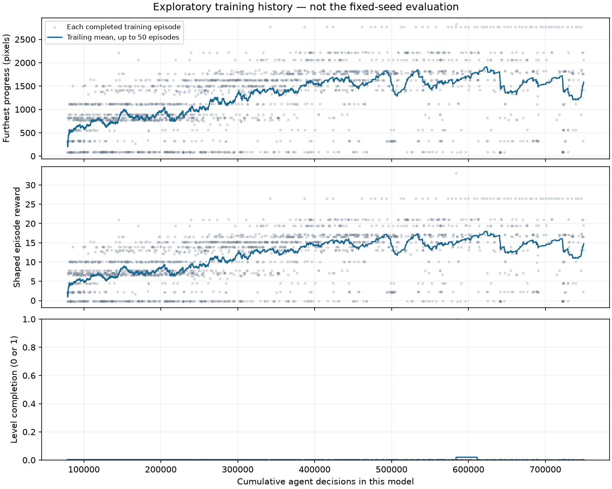

# Session 02 — final visual analysis

This is the approved 60-minute continuation of the pilot. The approved hour and all planned evaluations are complete. Earlier sections retain the chronological milestone interpretation. [Experiment plan](PLAN.md).

## Resumed starting policy

The starting evaluation reproduces the pilot final results exactly: progress 763, 319, 760, 1373 and 557 pixels, 0/5 clears, mean 754.4. See the [pilot analysis](../2026-09-16-smb3-pilot/ANALYSIS.md) and [new repeated measurements](00-resumed/evaluation.json). No learning is credited for saving the resumed model.

## Approximately 15 additional minutes

Actual active time: 900.66 seconds. New decisions: 151,041; cumulative model decisions: 229,622. The reward, actions and PPO settings remain unchanged.

| Seed | Starting progress | 15-minute progress | Change |
|---|---:|---:|---:|
| 101 | 763 | 1405 | +642 |
| 202 | 319 | 824 | +505 |
| 303 | 760 | 87 | -673 |
| 404 | 1373 | 1629 | +256 |
| 505 | 557 | 84 | -473 |

Mean progress rises from 754.4 to 805.8 pixels, but median progress is 824 and the range is 84–1629. All five trials die; none completes the level. The large spread and two severe regressions matter more than an isolated improved clip. [Measurements](01-stage/evaluation.json).

**Observed:** [seed 101](01-stage/trial-101-ending.gif) reaches the raised colored platforms with flying enemies and then dies. [Seed 404](01-stage/trial-404-ending.gif) crosses the gap before the wooden steps, then falls into the gap between wooden structures. [Seeds 303](01-stage/trial-303-ending.gif) and [505](01-stage/trial-505-ending.gif) jump early, encounter the first walking enemy and die. Their upward death animations should not be interpreted as successful jumps. Contact sheets are retained in the review directory and linked from the lesson page.

**Uncertain:** these trajectories do not reveal what the neural network recognizes or why it selects particular buttons. The mean increase is a small fixed-seed result, not evidence of reliable completion. We continue the already approved run with unchanged settings rather than react to one checkpoint.

## Approximately 30 additional minutes

Actual active time: 1,800.66 seconds. Cumulative model decisions: 404,899. Mean progress reaches 1,645.4 pixels (median 1,629; range 1,406–2,061), versus 805.8 at 15 minutes. All five trials die; completion remains 0/5. [Measurements](02-stage/evaluation.json).

| Seed | 15-minute progress | 30-minute progress | Change |
|---|---:|---:|---:|
| 101 | 1405 | 1406 | +1 |
| 202 | 824 | 2061 | +1237 |
| 303 | 87 | 1501 | +1414 |
| 404 | 1629 | 1629 | 0 |
| 505 | 84 | 1630 | +1546 |

**Observed improvement:** every sampled trial now passes the opening section. [Seed 202](02-stage/trial-202-ending.gif) reaches later brick structures with a red winged enemy. This is a broader improvement across the sampled trials, rather than one exceptional replay.

**Remaining failures:** [seed 101](02-stage/trial-101-ending.gif) still dies among flying enemies by the colored platforms. [Seed 303](02-stage/trial-303-ending.gif) falls into the gap before the wooden steps. [Seeds 404](02-stage/trial-404-ending.gif) and [505](02-stage/trial-505-ending.gif) fall into the gap between wooden structures. Seed 202 dies near the winged enemy on a narrow brick column. All five ending contact sheets are retained in `review/`.

**Hypotheses and limits:** repeated failures around gaps suggest a useful place to investigate jump trajectories, but these observations do not identify a cause. Opening failures may still occur with other action samples. Five seeds on one level do not establish reliability or generalization. The remaining approved training continues without parameter changes.

## Approximately 45 additional minutes — regression retained

Actual active time: 2,700.66 seconds. Cumulative model decisions: 584,549. Mean progress declines to 1,161.8 pixels, a decrease of 483.6 from the 30-minute checkpoint. Median is 1,121 and range 887–1,498. All five trials die, with 0/5 clears. [Measurements](03-stage/evaluation.json).

| Seed | 30-minute progress | 45-minute progress | Change |
|---|---:|---:|---:|
| 101 | 1406 | 1415 | +9 |
| 202 | 2061 | 887 | -1174 |
| 303 | 1501 | 1498 | -3 |
| 404 | 1629 | 888 | -741 |
| 505 | 1630 | 1121 | -509 |

**Observed:** [seed 101](03-stage/trial-101-ending.gif) still dies near flying enemies by the colored platforms. [Seeds 202](03-stage/trial-202-ending.gif) and [404](03-stage/trial-404-ending.gif) now die near the red winged enemy in the open area before the gaps. [Seed 303](03-stage/trial-303-ending.gif) again falls into the gap before the wooden steps; [seed 505](03-stage/trial-505-ending.gif) falls in an earlier gap. All ending contact sheets are retained in `review/`.

**Interpretation:** more training has not produced monotonic improvement on the fixed evaluation sample. We retain the better 30-minute model and this worse checkpoint rather than replacing either. The evidence does not identify a cause: catastrophic forgetting, update instability and action-sampling variation are possible topics for investigation, not demonstrated explanations. The final segment continues within the already approved hour, with no parameter changes.

## Approximately 60 additional minutes — recovery, but no reliable completion

Actual active time: 3,600.002 seconds. New decisions: 673,438; cumulative model decisions: 752,019. Mean progress reaches 2,211.6 pixels (median 2,220; range 1,628–2,769), versus 1,161.8 at 45 minutes and 754.4 at session start. All five paired trials improve relative to 45 minutes. This is still **0/5 clears**, with four deaths and one frame-limit termination. [Measurements](04-stage/evaluation.json).

| Seed | 45-minute progress | 60-minute progress | Change | Outcome |
|---|---:|---:|---:|---|
| 101 | 1415 | 1628 | +213 | Death |
| 202 | 887 | 2222 | +1335 | Death |
| 303 | 1498 | 2769 | +1271 | Frame limit |
| 404 | 888 | 2220 | +1332 | Death |
| 505 | 1121 | 2219 | +1098 | Death |

**Observed:** [seed 101](04-stage/trial-101-ending.gif) falls between wooden structures. [Seed 202](04-stage/trial-202-ending.gif), [404](04-stage/trial-404-ending.gif) and [505](04-stage/trial-505-ending.gif) reach the tall pipes, then fall into the narrow gap beside them. [Seed 303](04-stage/trial-303-ending.gif) reaches the black goal-card area, but Mario is to the right of the uncollected card and remains near the screen edge. The [trace](04-stage/trial-303.jsonl) first reaches x>=2792 at decision 372; all of the last 750 decisions have x=2792. The trial ends at 3,000 decisions / 12,000 action frames, without a clear.

**Concrete limitation:** the five-action set contains no leftward action. Once Mario passes the goal card and reaches the right boundary, it provides no way to return to the card. This is a stronger finding than saying that he needs more training. It does not prove that adding left will fix all failures, or establish why he missed the card in the first place. A separately versioned experiment could test recovery actions; this run intentionally kept its settings fixed.

## Final save and additional trials

The final save and 04-stage contain identical policy weights: SHA-256 `fdf76b992205691edc892a9dfac784afc2e88f8b1caabdf5df5d2b9fc2220298`. Their five-seed results match exactly; these are not independent improvements. Both files are preserved.

The ten additional action seeds produce **0/10 clears**, seven deaths and three frame limits. Mean progress is 1,980.1 pixels, range 88–2,770. These test action sampling on World 1-1, not generalization to another level or an independent training run. [Measurements](final-additional-trials/evaluation.json).

[Seed 6606](final-additional-trials/trial-6606-ending.gif) also stays to the right of the uncollected goal card; [seed 7010](final-additional-trials/trial-7010-ending.gif) dies near the first walking enemy. Thus neither goal completion nor opening reliability is solved. Representative contact sheets are retained in `review/`.

The repeated hold-run-right baseline remains 0/5 clears and 88 pixels in every trial. These are deterministic duplicate replays, not five independent conditions. [Baseline measurements](hold-run-right/evaluation.json).

## Training history versus evaluation

The training traces contain 2,261 completed episodes and **one telemetry-recorded clear**, with maximum progress 2,824 pixels. That training episode has a full action trace but no saved gameplay clip; do not present it as a visually reviewed successful evaluation. A trailing 2,197-decision partial episode is excluded from the episode chart. Training uses a changing policy and is not the frozen-policy evaluation. The final policy remains at 0/15 across the regular and additional evaluation seeds.

The curriculum lesson is that progress can increase, regress, then recover while the intended goal remains unsolved. The 45-minute regression is retained, and final long-distance stalls are failures rather than victories.

## Resource use and stop condition

The session used 60.000 active minutes and 62.105 wall minutes before chart generation. It collected 2,690,381 game action frames / 673,438 decisions and performed 1,314 PPO train calls / 26,418 optimizer steps. Evaluation subprocesses took 124.42 seconds; collection took 2,466.09 seconds, including 1,738.47 seconds of emulator stepping; learning took 1,132.48 seconds. These nested timings must not be added together.

The sampled peak RSS was 356.16 MiB for the parent process. macOS blocked child enumeration; this is **not a combined training-plus-evaluation peak**. The fallback and error are preserved in the manifest. The model loop made no GPT/API calls and used no paid cloud resources.

The approved hour has ended. No further training is running or authorized. Before any new experiment, consider testing a recovery action set and auditing goal-card behavior rather than assuming more unchanged training will solve the boundary failure.
