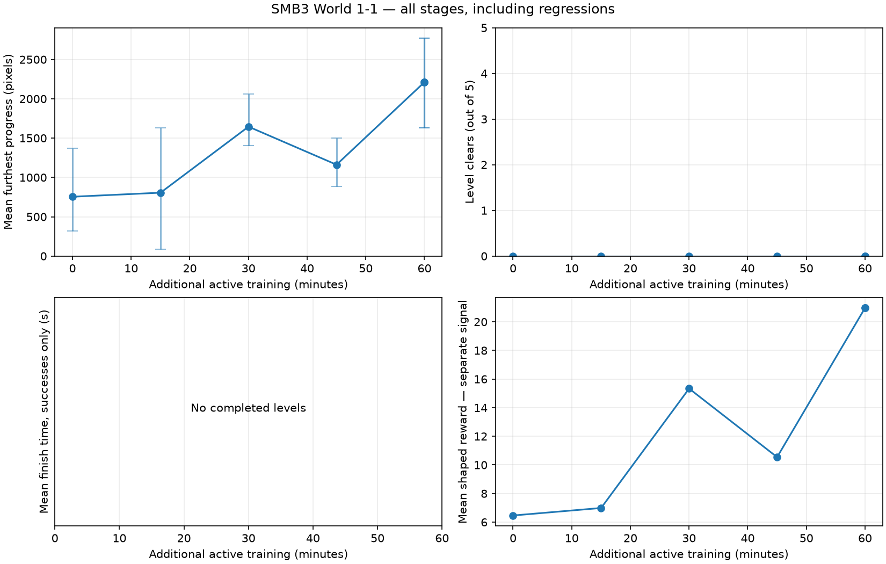
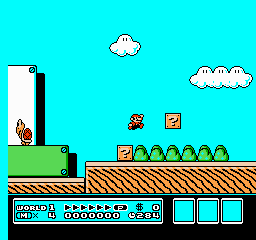
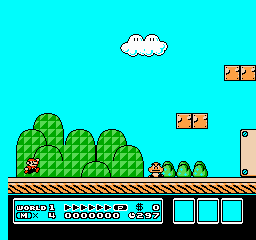
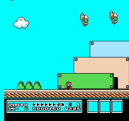
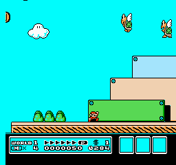
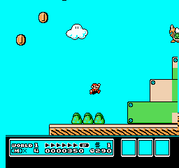
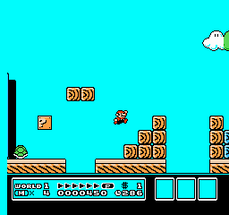
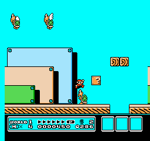

# SMB3 World 1-1 — 2026-09-16-smb3-session-02

Session status: **completed**. This is a local CPU experiment.

[Classroom learning timeline and stage explanations](LESSON.md) · [Manifest](manifest.json) · [Configuration](config.json) · [Dependencies](requirements.txt)

## Time and work measured

| Measurement | Value |
|---|---:|
| Session wall time before chart generation | 3726.31 s |
| Active training | 3600.00 s |
| Rollout collection (includes inference and traces) | 2466.09 s |
| Raw emulator stepping inside collection | 1738.47 s |
| Learning updates | 1132.48 s |
| Evaluation subprocesses (includes recording/startup) | 124.42 s |
| Checkpoint saving | 0.21 s |
| Training game frames | 2,690,381 |
| Agent decisions | 673,438 |
| PPO train calls / optimizer steps | 1314 / 26418 |
| Sampled peak RSS | 356.2 MiB (parent_only_fallback_used) |

Nested timing fields overlap: raw stepping is part of collection, and collection/learning are part of active training. RSS is sampled every 100 ms; shared pages may be counted twice. Reset/setup frames are excluded from action-frame counters.

Raw simulation: 1548 frames/s; end-to-end training: 747 frames/s; learning: 23.3 optimizer steps/s.

## Outcomes across stages

Error bars show the range across the five trials, not confidence intervals. Progress is furthest horizontal displacement from the start, in pixels, not a percentage of the level. Completion is measured independently. Finishing time uses action frames / 60, only for completed levels. Training reward is plotted separately and is not a success rate.

## 00-resumed

0.00 additional active minutes. Model SHA-256: `37b34760f34bc1101afbf3022c2a009544d0fdba75e132c1501f064ece2de1f2`.

Evaluation **complete**: 5/5 finished trials. [Full measurements](00-resumed/evaluation.json).

**Observed measurements:** 0/5 clears; 5 deaths; mean progress 754.4 pixels (range 319–1373); mean shaped reward 6.464.

| Trial | Progress (pixels) | Outcome | Evidence |
|---|---:|---|---|
| 101 | 763 | death | [Trace](00-resumed/trial-101.jsonl) · [beginning](00-resumed/trial-101-beginning.gif) · [ending](00-resumed/trial-101-ending.gif) |
| 202 | 319 | death | [Trace](00-resumed/trial-202.jsonl) · [beginning](00-resumed/trial-202-beginning.gif) · [ending](00-resumed/trial-202-ending.gif) |
| 303 | 760 | death | [Trace](00-resumed/trial-303.jsonl) · [beginning](00-resumed/trial-303-beginning.gif) · [ending](00-resumed/trial-303-ending.gif) |
| 404 | 1373 | death | [Trace](00-resumed/trial-404.jsonl) · [beginning](00-resumed/trial-404-beginning.gif) · [ending](00-resumed/trial-404-ending.gif) |
| 505 | 557 | death | [Trace](00-resumed/trial-505.jsonl) · [beginning](00-resumed/trial-505-beginning.gif) · [ending](00-resumed/trial-505-ending.gif) |

| Beginning · seed 101 · decisions 1–150 | Ending · seed 101 · decisions 164–238 |
|---|---|
|  |  |

The middle of this trial is omitted from these excerpts; the full action trace is retained.

## 01-stage

15.01 additional active minutes. Model SHA-256: `c8942d9d616f78297ef12a176793d703026f7a37c85353915aff9fd7951d6e4d`.

Evaluation **complete**: 5/5 finished trials. [Full measurements](01-stage/evaluation.json).

**Observed measurements:** 0/5 clears; 5 deaths; mean progress 805.8 pixels (range 84–1629); mean shaped reward 6.988.

Mean progress changed by +51.4 pixels; completion count changed by +0. Improvement is not assumed, and five action samples are a small evaluation.

| Trial | Progress (pixels) | Outcome | Evidence |
|---|---:|---|---|
| 101 | 1405 | death | [Trace](01-stage/trial-101.jsonl) · [beginning](01-stage/trial-101-beginning.gif) · [ending](01-stage/trial-101-ending.gif) |
| 202 | 824 | death | [Trace](01-stage/trial-202.jsonl) · [beginning](01-stage/trial-202-beginning.gif) · [ending](01-stage/trial-202-ending.gif) |
| 303 | 87 | death | [Trace](01-stage/trial-303.jsonl) · [beginning](01-stage/trial-303-beginning.gif) · [ending](01-stage/trial-303-ending.gif) |
| 404 | 1629 | death | [Trace](01-stage/trial-404.jsonl) · [beginning](01-stage/trial-404-beginning.gif) · [ending](01-stage/trial-404-ending.gif) |
| 505 | 84 | death | [Trace](01-stage/trial-505.jsonl) · [beginning](01-stage/trial-505-beginning.gif) · [ending](01-stage/trial-505-ending.gif) |

| Beginning · seed 101 · decisions 1–150 | Ending · seed 101 · decisions 182–256 |
|---|---|
|  |  |

The middle of this trial is omitted from these excerpts; the full action trace is retained.

## 02-stage

30.01 additional active minutes. Model SHA-256: `9ac37ce26177cd7b4ac5f313c0cf46c95130f763a50fad0b207d2002385b251b`.

Evaluation **complete**: 5/5 finished trials. [Full measurements](02-stage/evaluation.json).

**Observed measurements:** 0/5 clears; 5 deaths; mean progress 1645.4 pixels (range 1406–2061); mean shaped reward 15.335.

Mean progress changed by +839.6 pixels; completion count changed by +0. Improvement is not assumed, and five action samples are a small evaluation.

| Trial | Progress (pixels) | Outcome | Evidence |
|---|---:|---|---|
| 101 | 1406 | death | [Trace](02-stage/trial-101.jsonl) · [beginning](02-stage/trial-101-beginning.gif) · [ending](02-stage/trial-101-ending.gif) |
| 202 | 2061 | death | [Trace](02-stage/trial-202.jsonl) · [beginning](02-stage/trial-202-beginning.gif) · [ending](02-stage/trial-202-ending.gif) |
| 303 | 1501 | death | [Trace](02-stage/trial-303.jsonl) · [beginning](02-stage/trial-303-beginning.gif) · [ending](02-stage/trial-303-ending.gif) |
| 404 | 1629 | death | [Trace](02-stage/trial-404.jsonl) · [beginning](02-stage/trial-404-beginning.gif) · [ending](02-stage/trial-404-ending.gif) |
| 505 | 1630 | death | [Trace](02-stage/trial-505.jsonl) · [beginning](02-stage/trial-505-beginning.gif) · [ending](02-stage/trial-505-ending.gif) |

| Beginning · seed 101 · decisions 1–150 | Ending · seed 101 · decisions 189–263 |
|---|---|
|  |  |

The middle of this trial is omitted from these excerpts; the full action trace is retained.

## 03-stage

45.01 additional active minutes. Model SHA-256: `677364433c0fe787d1e67d24030e829d5c3bac677baa16b3ee2e46d054b819db`.

Evaluation **complete**: 5/5 finished trials. [Full measurements](03-stage/evaluation.json).

**Observed measurements:** 0/5 clears; 5 deaths; mean progress 1161.8 pixels (range 887–1498); mean shaped reward 10.543.

Mean progress changed by -483.6 pixels; completion count changed by +0. Improvement is not assumed, and five action samples are a small evaluation.

| Trial | Progress (pixels) | Outcome | Evidence |
|---|---:|---|---|
| 101 | 1415 | death | [Trace](03-stage/trial-101.jsonl) · [beginning](03-stage/trial-101-beginning.gif) · [ending](03-stage/trial-101-ending.gif) |
| 202 | 887 | death | [Trace](03-stage/trial-202.jsonl) · [beginning](03-stage/trial-202-beginning.gif) · [ending](03-stage/trial-202-ending.gif) |
| 303 | 1498 | death | [Trace](03-stage/trial-303.jsonl) · [beginning](03-stage/trial-303-beginning.gif) · [ending](03-stage/trial-303-ending.gif) |
| 404 | 888 | death | [Trace](03-stage/trial-404.jsonl) · [beginning](03-stage/trial-404-beginning.gif) · [ending](03-stage/trial-404-ending.gif) |
| 505 | 1121 | death | [Trace](03-stage/trial-505.jsonl) · [beginning](03-stage/trial-505-beginning.gif) · [ending](03-stage/trial-505-ending.gif) |

| Beginning · seed 101 · decisions 1–150 | Ending · seed 101 · decisions 125–199 |
|---|---|
|  |  |

These excerpts overlap; they are two views of the same trial.

## 04-stage

60.00 additional active minutes. Model SHA-256: `79b6df4826090153f2fe39a9a55fd0bd6f8c0a664505c5e6671462b948e956cc`.

Evaluation **complete**: 5/5 finished trials. [Full measurements](04-stage/evaluation.json).

**Observed measurements:** 0/5 clears; 4 deaths; mean progress 2211.6 pixels (range 1628–2769); mean shaped reward 20.971.

Mean progress changed by +1049.8 pixels; completion count changed by +0. Improvement is not assumed, and five action samples are a small evaluation.

| Trial | Progress (pixels) | Outcome | Evidence |
|---|---:|---|---|
| 101 | 1628 | death | [Trace](04-stage/trial-101.jsonl) · [beginning](04-stage/trial-101-beginning.gif) · [ending](04-stage/trial-101-ending.gif) |
| 202 | 2222 | death | [Trace](04-stage/trial-202.jsonl) · [beginning](04-stage/trial-202-beginning.gif) · [ending](04-stage/trial-202-ending.gif) |
| 303 | 2769 | frame_limit | [Trace](04-stage/trial-303.jsonl) · [beginning](04-stage/trial-303-beginning.gif) · [ending](04-stage/trial-303-ending.gif) |
| 404 | 2220 | death | [Trace](04-stage/trial-404.jsonl) · [beginning](04-stage/trial-404-beginning.gif) · [ending](04-stage/trial-404-ending.gif) |
| 505 | 2219 | death | [Trace](04-stage/trial-505.jsonl) · [beginning](04-stage/trial-505-beginning.gif) · [ending](04-stage/trial-505-ending.gif) |

| Beginning · seed 101 · decisions 1–150 | Ending · seed 101 · decisions 178–252 |
|---|---|
|  |  |

The middle of this trial is omitted from these excerpts; the full action trace is retained.

## final

60.00 additional active minutes. Model SHA-256: `2086c553c2f2f795861a991e8c5b0253154526fdca5524a27833fa890c12b2fa`.

Evaluation **complete**: 5/5 finished trials. [Full measurements](final/evaluation.json).

**Observed measurements:** 0/5 clears; 4 deaths; mean progress 2211.6 pixels (range 1628–2769); mean shaped reward 20.971.

Mean progress changed by +0.0 pixels; completion count changed by +0. Improvement is not assumed, and five action samples are a small evaluation.

| Trial | Progress (pixels) | Outcome | Evidence |
|---|---:|---|---|
| 101 | 1628 | death | [Trace](final/trial-101.jsonl) · [beginning](final/trial-101-beginning.gif) · [ending](final/trial-101-ending.gif) |
| 202 | 2222 | death | [Trace](final/trial-202.jsonl) · [beginning](final/trial-202-beginning.gif) · [ending](final/trial-202-ending.gif) |
| 303 | 2769 | frame_limit | [Trace](final/trial-303.jsonl) · [beginning](final/trial-303-beginning.gif) · [ending](final/trial-303-ending.gif) |
| 404 | 2220 | death | [Trace](final/trial-404.jsonl) · [beginning](final/trial-404-beginning.gif) · [ending](final/trial-404-ending.gif) |
| 505 | 2219 | death | [Trace](final/trial-505.jsonl) · [beginning](final/trial-505-beginning.gif) · [ending](final/trial-505-ending.gif) |

| Beginning · seed 101 · decisions 1–150 | Ending · seed 101 · decisions 178–252 |
|---|---|
|  |  |

The middle of this trial is omitted from these excerpts; the full action trace is retained.

## Run right baseline

Status: complete. [Measurements](hold-run-right/evaluation.json).

0/5 clears; mean progress 88.0 pixels. Additional seeds are action samples on the same level, not unseen levels.

| Trial | Progress (pixels) | Outcome | Evidence |
|---|---:|---|---|
| 101 | 88 | death | [Trace](hold-run-right/trial-101.jsonl) · [beginning](hold-run-right/trial-101-beginning.gif) · [ending](hold-run-right/trial-101-ending.gif) |
| 202 | 88 | death | [Trace](hold-run-right/trial-202.jsonl) · [beginning](hold-run-right/trial-202-beginning.gif) · [ending](hold-run-right/trial-202-ending.gif) |
| 303 | 88 | death | [Trace](hold-run-right/trial-303.jsonl) · [beginning](hold-run-right/trial-303-beginning.gif) · [ending](hold-run-right/trial-303-ending.gif) |
| 404 | 88 | death | [Trace](hold-run-right/trial-404.jsonl) · [beginning](hold-run-right/trial-404-beginning.gif) · [ending](hold-run-right/trial-404-ending.gif) |
| 505 | 88 | death | [Trace](hold-run-right/trial-505.jsonl) · [beginning](hold-run-right/trial-505-beginning.gif) · [ending](hold-run-right/trial-505-ending.gif) |

| Beginning · seed 101 · decisions 1–65 | Ending · seed 101 · decisions 1–65 |
|---|---|
|  |  |

These excerpts overlap; they are two views of the same trial.

## Final additional trials

Status: complete. [Measurements](final-additional-trials/evaluation.json).

0/10 clears; mean progress 1980.1 pixels. Additional seeds are action samples on the same level, not unseen levels.

| Trial | Progress (pixels) | Outcome | Evidence |
|---|---:|---|---|
| 6101 | 1500 | death | [Trace](final-additional-trials/trial-6101.jsonl) · [beginning](final-additional-trials/trial-6101-beginning.gif) · [ending](final-additional-trials/trial-6101-ending.gif) |
| 6202 | 1767 | death | [Trace](final-additional-trials/trial-6202.jsonl) · [beginning](final-additional-trials/trial-6202-beginning.gif) · [ending](final-additional-trials/trial-6202-ending.gif) |
| 6303 | 1629 | death | [Trace](final-additional-trials/trial-6303.jsonl) · [beginning](final-additional-trials/trial-6303-beginning.gif) · [ending](final-additional-trials/trial-6303-ending.gif) |
| 6404 | 2067 | death | [Trace](final-additional-trials/trial-6404.jsonl) · [beginning](final-additional-trials/trial-6404-beginning.gif) · [ending](final-additional-trials/trial-6404-ending.gif) |
| 6505 | 2221 | death | [Trace](final-additional-trials/trial-6505.jsonl) · [beginning](final-additional-trials/trial-6505-beginning.gif) · [ending](final-additional-trials/trial-6505-ending.gif) |
| 6606 | 2770 | frame_limit | [Trace](final-additional-trials/trial-6606.jsonl) · [beginning](final-additional-trials/trial-6606-beginning.gif) · [ending](final-additional-trials/trial-6606-ending.gif) |
| 6707 | 2769 | frame_limit | [Trace](final-additional-trials/trial-6707.jsonl) · [beginning](final-additional-trials/trial-6707-beginning.gif) · [ending](final-additional-trials/trial-6707-ending.gif) |
| 6808 | 2221 | death | [Trace](final-additional-trials/trial-6808.jsonl) · [beginning](final-additional-trials/trial-6808-beginning.gif) · [ending](final-additional-trials/trial-6808-ending.gif) |
| 6909 | 2769 | frame_limit | [Trace](final-additional-trials/trial-6909.jsonl) · [beginning](final-additional-trials/trial-6909-beginning.gif) · [ending](final-additional-trials/trial-6909-ending.gif) |
| 7010 | 88 | death | [Trace](final-additional-trials/trial-7010.jsonl) · [beginning](final-additional-trials/trial-7010-beginning.gif) · [ending](final-additional-trials/trial-7010-ending.gif) |

| Beginning · seed 6101 · decisions 1–150 | Ending · seed 6101 · decisions 182–256 |
|---|---|
|  |  |

The middle of this trial is omitted from these excerpts; the full action trace is retained.

## Recording overhead

## Interpretation

[Read the visual stage-by-stage analysis](ANALYSIS.md).

[Verified downloadable model checkpoints](MODELS.md) · [Download verification manifest](release.json).
