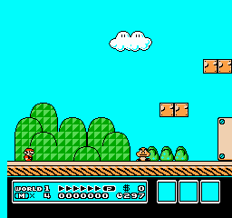
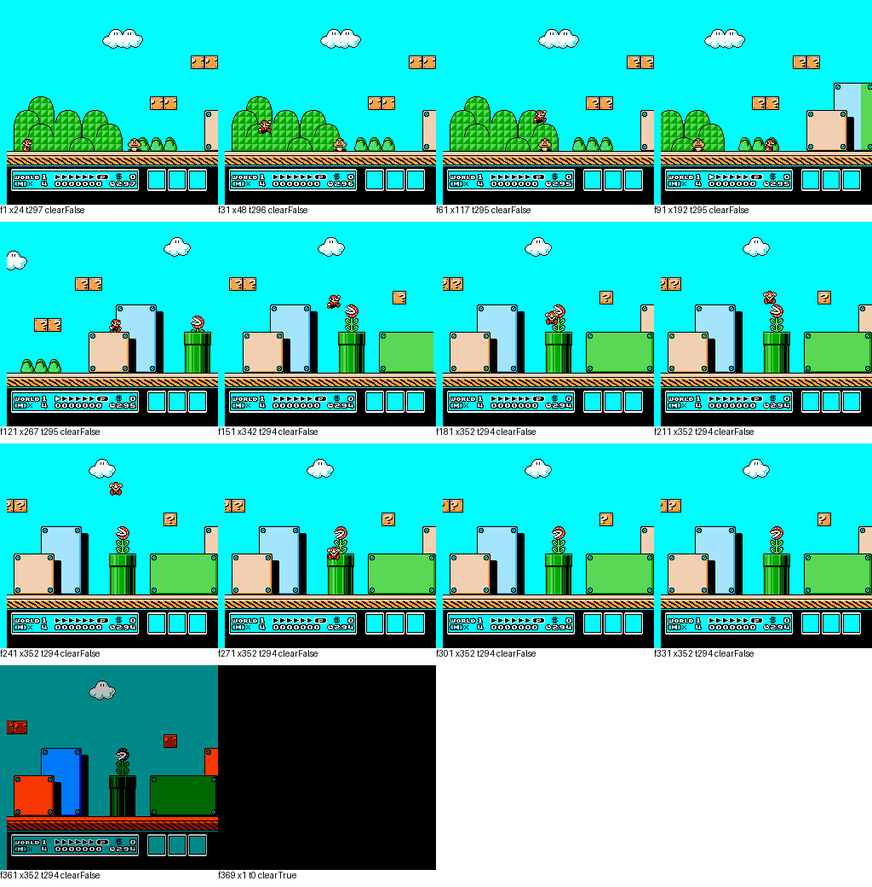
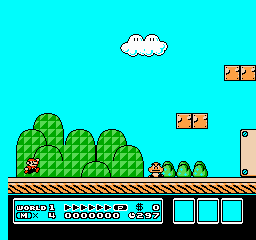
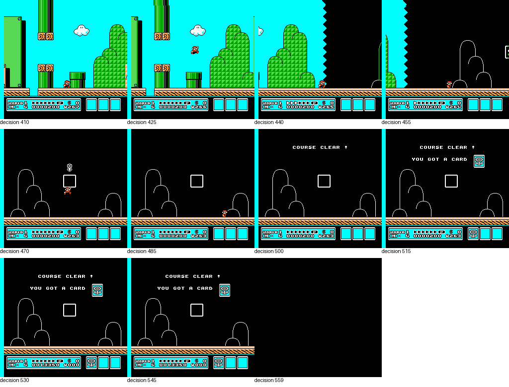

# SMB3 World 1-1 validation

This session validates the environment before a fresh PPO pilot. It is **not learned-policy performance**. See [validation.json](validation.json) for check status, dependency versions and fingerprints.

## Initial state and controls

Ten reset/replay comparisons test deterministic starting pixels/RAM and the same 120-frame action trace. Seeds do not create different levels. The policy observes four grayscale 84×84 frames; reward and measurement use RAM separately.

Control probes: [coast](control-0.gif), [walk right](control-1.gif), [jump right](control-2.gif), [run right](control-3.gif), [run and jump](control-4.gif). Their corresponding JSON files record exact positions and outcomes. A short initial no-button decision releases the controller before comparing actions.

## A false success caught visually

The uncorrected package reported a clear at raw frame 369 near x=352. It was a death transition, not the end of World 1-1. [Raw evidence](suspect-clear.json).

The adapter now requires the exact World 1-1 map-panel coordinates as well as the alive-return checks before accepting a clear. The same control sequence ends as a death at frame 370. [Corrected trace](corrected-death-trace.json).

This matters because a false success signal could train and evaluate an agent incorrectly even when the screenshots and model run normally.

## Positive completion validation

A scripted controller, separate from PPO, traverses the course to validate genuine completion. The [action list](scripted-clear-actions.json) and [full trace](scripted-clear-trace.json) make the replay reproducible. It is not an untrained baseline and is never used as a demonstration for the learning model.

[Ending gameplay](scripted-clear-ending.gif) · [Terminal frame](scripted-clear-end.png) · [Map displayed 60 frames later](scripted-clear-map-plus60.png)

The correction is restricted to World 1-1 and this action set. Other levels, alternate exits and different actions need new validation. Frame durations use nominal 60 FPS; counters record exact action frames, not wall time. Reset/menu preparation frames are excluded.

The clear event is emitted during the map-state transition, before the map is fully drawn. The extra map image advances 60 unscored validation-only frames after termination; those frames are not part of the episode or its finishing time.
